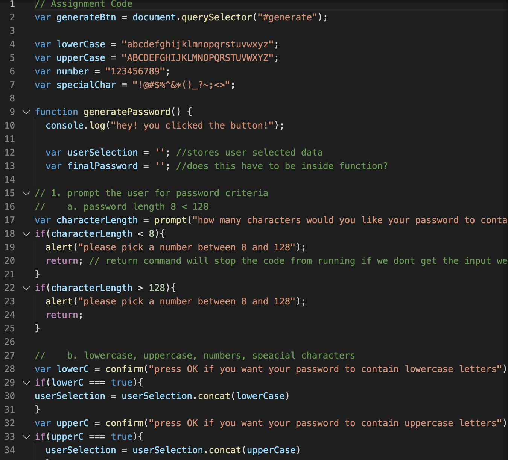

# Password-generator-HW3

In this Homework a Random Password Generator was created. 

I added and modified command lines in the JS file in order to make this function by:

* Creating variables to store user data.
* Created prompts in order to get password Criteria. 
* Created if statments to set perameters to random password.
* Created a for loop to createa random password using stored user data.
* created a function to write the password on the Page. 

